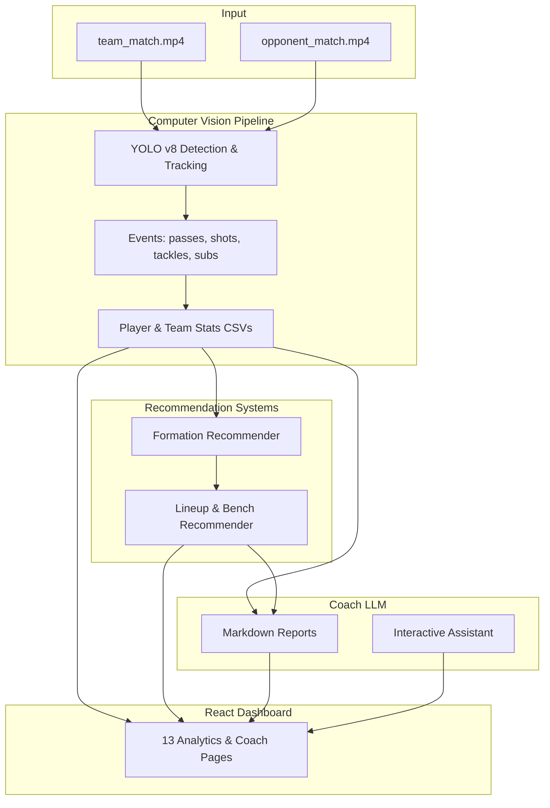

# Tactic Zone — Feature Overview

Tactic Zone is a **match analysis and coach assistant** platform. It processes broadcast football videos for your team and your opponent, extracts structured statistics via computer vision, runs ML recommendation systems, and surfaces everything in a React dashboard with an AI coach layer for reports and interactive chat.

---

## What the App Does (End-to-End)

1. **Input** — Two match videos: your team (`input_videos/team_match.mp4`) and opponent (`input_videos/opponent_match.mp4`). Requires eagle-eye / broadcast quality (1080p+).
2. **Process** — YOLO-based CV pipeline tracks players, ball, events, formations, and physical metrics frame-by-frame.
3. **Analyze** — Stats are aggregated into team/player CSVs; recommendation systems suggest formations, lineups, and bench players.
4. **Coach layer** — Football Coach LLM generates markdown reports and answers tactical questions in chat.
5. **Explore** — Multi-page dashboard visualizes KPIs, tracking, tactics, recommendations, reports, and live pipeline progress.

---

## Architecture



---

## 1. Computer Vision & Match Analysis

The core pipeline (`main.py`, `end_points.py`) processes videos in batches and produces structured CSV outputs.

### Detection & Tracking

| Module | Feature |
|--------|---------|
| **Object tracker** | Tracks players, goalkeepers, referees, and ball across frames |
| **Team assigner** | K-means on shirt colors to assign each player to a team |
| **Player number detector** | OCR + YOLO for shirt numbers |
| **Camera movement estimator** | Compensates for camera pan/zoom when mapping positions |
| **View transformer** | Perspective transform to normalize pitch coordinates |
| **Speed & distance** | Per-player max speed, average speed, distance covered |

### Event Detection

| Module | Feature |
|--------|---------|
| **Pass detector** | Successful, failed, and intercepted passes |
| **Shot detector** | Shots on/off target, goals, saves, blocks, key passes, assists |
| **Event processor** | Dribbles, duels, tackles, injuries |
| **Formation detector** | Detects formation (4-3-3, 4-4-2, 3-5-2, etc.) from player positions |
| **Substitution detector** | Reads substitution boards (digital number detection) |
| **Goal & line processor** | Goal and goal-line segmentation for spatial context |
| **Player–ball assigner** | Links ball possession to player and team per frame |

### Aggregated Statistics

| Output CSV | Contents |
|------------|----------|
| `tracks_csv_video_{1,2}.csv` | Frame-by-frame bounding boxes, class labels, positions |
| `player_statistics_video_{1,2}.csv` | Per-player match stats (passes, shots, distance, etc.) |
| `team_statistics_video_{1,2}.csv` | Team-level aggregates |
| `team_{1,2}_player_statistics_video_{1,2}.csv` | Squad-split player stats |
| `teams_final_statistics_video_{1,2}.csv` | Final team summary (score, formation, possession, etc.) |

### Trained Models

- `old_data.pt` — Players, ball, goalkeepers, goals (primary objects)
- `new_data.pt` — Events (dribble, tackle, goal line, etc.)
- `playershirt.pt` — Shirt number detection
- `Substitution.pt` — Substitution board numbers

Download via `download_models.sh` or automatically on first API run.

---

## 2. Recommendation Systems

Built on historical match data (900 matches, 5 leagues) plus your extracted stats.

| Feature | Description |
|---------|-------------|
| **Formation recommender** | Suggests best formations to beat the opponent based on play style matching |
| **Starting XI recommender** | Picks optimal 11 from your squad for the recommended formation |
| **Bench recommender** | Identifies game-changing substitutes |
| **Team comparison** | Side-by-side metrics: your team vs opponent |
| **Player mapping** | Maps detected players to historical dataset profiles |

### Output Files

| File | Purpose |
|------|---------|
| `recommended_formations.csv` | Ranked formation options with expected outcomes |
| `my_team.csv` / `opponent_team.csv` | Processed team profiles for recommender input |
| `combined_team.csv` | Merged squad data |
| `closest_player_data_mobile{1,2}.csv` | Closest historical player matches |

---

## 3. Coach LLM Layer

Football Coach LLM (`ALIENTELLIGENCE/footballcoachassistant`) replaces Gemini for reports and chat. Runs via **local Ollama** or **remote Colab/ngrok**.

### AI Reports

Generated from recommendation + CV CSVs and stored in `output_files_recommendation_systems/coach_reports.json`.

| Report | Content |
|--------|---------|
| **Match Summary** | Executive summary, team performance, key patterns, tactical adjustments |
| **Opponent Analysis** | Strengths, weaknesses, key players to mark, counter strategies, set-piece notes |
| **Lineup Recommendations** | Narrative explanation of suggested formation and starting XI |
| **Training Plan** | Drills and focus areas based on weaknesses |
| **Halftime Brief** | Condensed first-half analysis (halftime pipeline mode) |

Generate via dashboard **Reports** page or CLI:

```bash
python run_post_processing.py --reports-only
python run_post_processing.py --report halftime
```

### Coach Assistant (Chat)

Interactive Q&A grounded in match data with multiple context modes:

| Context | What the assistant sees |
|---------|-------------------------|
| `match` | Your team match stats |
| `opponent` | Opponent match stats |
| `both` | Both matches |
| `training` | Recommendation comparison metrics |
| `tactical` | Thirds occupancy, width, compactness |

**Additional chat capabilities:**

- Conversation history (last 20 turns)
- Suggested starter prompts (formations, weaknesses, halftime adjustments)
- Scenario detection — hypothetical questions (corners, scorelines, set pieces) skip irrelevant CSV context
- Set-piece fallback — full structured defensive plans when the model stops early
- Health check endpoint to verify Colab/Ollama connectivity

---

## 4. React Dashboard (13 Pages)

Dark sports-themed UI built with React 18, TypeScript, Vite, TanStack Query, Recharts, and Tailwind v4.

| Route | Page | Features |
|-------|------|----------|
| `/` | **Overview** | Cross-match KPIs, goals/shots/passes/distance cards, comparison bar charts, shot breakdown, pass accuracy donut, distance leaders, tackle charts, drill-down links |
| `/match` | **Match Summary** | Formations, score, substitutions, team color badges, per-team stat panels |
| `/players` | **Player Stats** | Sortable player table, team filter, minimum distance filter, leaderboards |
| `/squads` | **Squad Breakdown** | Team 1 vs Team 2 squad views, per-player cards |
| `/physical` | **Physical Performance** | Distance covered, speed metrics, physical load charts |
| `/events` | **Events & Formations** | Detected formations, event counts (corners, interceptions, clearances, tackles, key passes) |
| `/tracking` | **Tracking Explorer** | Frame-by-frame object positions, class filter, pagination, pitch visualization |
| `/recommendations` | **Recommendations** | Formation table, lineup pitch diagram, my team vs opponent cards, squad tables, comparison chart |
| `/reports` | **Reports** | List AI coach reports, generate full/halftime reports, markdown rendering |
| `/assistant` | **Coach Assistant** | Chat UI, context selector, suggested prompts, streaming-style loading |
| `/live` | **Live Monitor** | Pipeline progress bar, phase indicator, rolling interim stats during processing |
| `/tactical` | **Tactical** | Pitch thirds occupancy (% defensive/middle/attacking), average team width, compactness |
| `/timeline` | **Timeline** | Frame scrubber, event markers on pitch SVG, temporal exploration |

### Global UI Features

- **Match selector** — Switch between Video 1 (my team) and Video 2 (opponent) across pages
- **Sidebar navigation** — All 13 pages with icons
- **Loading & empty states** — Graceful handling when pipeline hasn't run
- **Responsive layout** — Grid-based cards and charts

---

## 5. Pipeline Modes

Configurable via `POST /process_videos`, `python main.py --mode`, or dashboard live trigger.

| Mode | Behavior |
|------|----------|
| **`full`** | Complete match analysis for both videos (default) |
| **`halftime`** | First half only (~50% frames) + halftime brief report |
| **`live_lite`** | Smaller batches (100 frames), skips OCR every 3rd batch, writes interim CSV snapshots after each batch for live dashboard polling |

### Live Processing

During `live_lite` mode:

- `LiveState` tracks current video, frame, progress %, and phase (`cv` → `recsys` → `reports` → `done`)
- Interim stats written to CSV via `utils/interim_stats.py`
- Dashboard **Live Monitor** polls `/api/live/snapshot` for rolling updates

---

## 6. REST API

Base URL: `http://127.0.0.1:8000/api`

### Status & Live

| Method | Endpoint | Description |
|--------|----------|-------------|
| GET | `/status` | Analytics ready flag, processing state, live snapshot |
| GET | `/live/snapshot` | Live progress + rolling overview stats |

### Analytics

| Method | Endpoint | Description |
|--------|----------|-------------|
| GET | `/analytics/overview` | Cross-match KPIs and comparison |
| GET | `/analytics/matches/{1\|2}` | Match summary for a video |
| GET | `/analytics/players/{1\|2}` | Player stats (team filter, min distance) |
| GET | `/analytics/squads/{1\|2}/{1\|2}` | Squad breakdown |
| GET | `/analytics/tracking/{1\|2}` | Frame-level tracking data (paginated) |
| GET | `/analytics/tracking/{1\|2}/heatmap` | Position heatmap sample |
| GET | `/analytics/tactical/{1\|2}` | Thirds, width, compactness |
| GET | `/analytics/timeline/{1\|2}` | Timeline event markers |

### Recommendations

| Method | Endpoint | Description |
|--------|----------|-------------|
| GET | `/recommendations/formations` | Recommended formations |
| GET | `/recommendations/lineup` | Starting XI + bench |
| GET | `/recommendations/teams` | My team vs opponent profiles |
| GET | `/recommendations/squads` | Squad recommendation data |
| GET | `/recommendations/compare` | Metric-by-metric comparison |

### Coach LLM

| Method | Endpoint | Description |
|--------|----------|-------------|
| GET | `/reports` | Load all coach reports |
| GET | `/reports/{id}` | Single report by ID |
| POST | `/reports/generate` | Generate reports (`mode`: full \| halftime) |
| GET | `/assistant/health` | LLM connectivity check |
| POST | `/assistant/chat` | Send chat message (`message`, `context`, `video_id`) |
| GET | `/assistant/history` | Chat history + suggested prompts |
| DELETE | `/assistant/history` | Clear chat history |

### Match Library

| Method | Endpoint | Description |
|--------|----------|-------------|
| GET | `/matches` | List saved match snapshots |
| POST | `/matches/snapshot` | Save current stats + reports to SQLite |
| GET | `/matches/trends` | Aggregated trends across saved matches |
| GET | `/matches/{id}` | Single saved match detail |

### Pipeline Trigger

| Method | Endpoint | Description |
|--------|----------|-------------|
| POST | `/process_videos` | Start CV pipeline (optional `mode`: full \| halftime \| live_lite) |
| GET | `/get_json_outputs` | Legacy JSON outputs endpoint |

---

## 7. Match Library

SQLite database (`data/matches.db`) stores snapshots of analysis runs:

- Label, opponent name, pipeline mode, timestamp
- Full overview stats JSON
- Coach reports JSON at time of save
- Trends endpoint for comparing multiple saved matches over time

---

## 8. How to Run

### Prerequisites

- Python 3.10+
- Node.js 18+
- Football Coach LLM (Ollama local or Colab/ngrok remote)
- Completed pipeline CSVs (or run pipeline first)

### Environment

Copy `.env.example` to `.env`:

```bash
COACH_LLM_PROVIDER=ngrok          # or ollama
COACH_LLM_BASE_URL=https://your-ngrok-url.ngrok-free.dev
```

### Start Stack

**Terminal 1 — API:**

```bash
cd Tactic_Zone
python -m uvicorn api_server:app --host 127.0.0.1 --port 8000
```

**Terminal 2 — Dashboard:**

```bash
cd Tactic_Zone/dashboard
npm install
npm run dev
```

Open **http://localhost:5173**

### Run Pipeline

```bash
# Full analysis (CLI)
python main.py --mode full

# Halftime only
python main.py --mode halftime

# Live lite with interim snapshots
python main.py --mode live_lite

# Reports only (from existing CSVs)
python run_post_processing.py --reports-only
```

### Production

```bash
cd dashboard && npm run build
cd .. && python api_server.py
# Serves built dashboard at http://localhost:8000
```

---

## 9. Tech Stack

| Layer | Technologies |
|-------|--------------|
| **Computer vision** | YOLO v8 (Ultralytics), OpenCV, Supervision, Optical Flow |
| **ML / stats** | pandas, numpy, scikit-learn, PuLP (linear programming) |
| **Recommendations** | Custom models trained on 900-match historical dataset |
| **Coach LLM** | Football Coach 8B (Ollama / llama.cpp on Colab) |
| **Backend API** | FastAPI, uvicorn, SQLite |
| **Frontend** | React 18, TypeScript, Vite, TanStack Query, Recharts, Tailwind v4, react-markdown |
| **Legacy** | Gemini integration (still in repo, replaced by Football Coach LLM for reports/chat) |

---

## 10. Data Flow Summary

```
Videos → CV Pipeline → CSV Stats → Recommendation Systems → Coach Reports
                ↓                        ↓                        ↓
         Tracking CSVs            Formation/Lineup CSVs      coach_reports.json
                ↓                        ↓                        ↓
         Dashboard Pages          Recommendations Page      Reports Page
                ↓
         Tactical / Timeline / Live Monitor
                ↓
         Coach Assistant Chat (stats + tactical Q&A)
```

---

## 11. Key Constraints

- **Video quality** — Designed for broadcast / eagle-eye 1080p+ footage; lower quality produces unreliable output.
- **Processing time** — Full CPU pipeline can take ~1 hour per video; GPU and `live_lite` mode reduce latency.
- **Coach LLM** — Remote Colab/ngrok URLs expire; update `.env` when the tunnel restarts. The 8B model gives brief answers on complex scenarios; set-piece fallback templates supplement chat.
- **Two videos** — Video 1 = your team, Video 2 = opponent (hardcoded paths in pipeline).

---

## 12. Project Structure (Quick Reference)

```
Tactic_Zone/
├── main.py                    # CLI pipeline entry
├── end_points.py              # Full pipeline + FastAPI (with ngrok/Firebase)
├── api_server.py              # Lightweight dev/production API server
├── run_post_processing.py     # Reports-only generation
├── pipeline_config.py         # full | halftime | live_lite modes
├── api/                       # FastAPI services (analytics, coach, live, tactical)
├── dashboard/                 # React frontend (13 pages)
├── generate_prompt/           # Coach LLM report prompts
├── output_files_computer_vision/      # CV CSV outputs
├── output_files_recommendation_systems/  # Recsys + coach_reports.json
├── input_videos/              # Match video inputs
├── models/                    # YOLO weights
└── data/                      # SQLite match library
```
